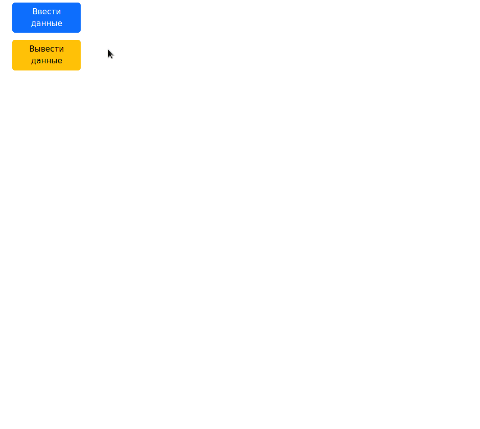

# Одностраничное приложение (SPA)

Данное одностраничное приложение (SPA) написано в образовательных и демонстрационных целях.
Приложение состоит из двух независимых блоков, переключающих формы ввода данных:

- блока ввода данных;
- блока вывода информации.  

Каждый блок сопровождается блоком постраничной навигации, отображающем необходимые в данный момент кнопки перехода по страницам в зависимости от их количества.  
Вся `html` разметка, кроме двух кнопок на главной странице загружается динамически, по требованию, посредством `jQuery`.  
Все действия: такие как динамическая загрузка контента, или постраничная навигация, осуществляются без перезагрузки страницы с помощью `jQuery ajax`.

### Блок ввода данных

Блок ввода данных состоит из формы ввода и таблицы вывода записей.
Блок ввода данных принимает данные из трех полей формы ввода, проверяет на отсутствие пустых полей и вносит введенные значения в базу данных.  
В форме ввода данных присутствует кнопка `"Очистить БД"`, при нажатии на которую таблица со значениями, введенными через форму полностью очищается, одновременно с этим запускается проверка на наличие данных в таблице и, при их отсутствии блок постраничной навигации посредством `jQuery` скрывается.  

### Блок вывода информации

Блок вывода информации содержит форму входа для доступа к защищенной части базы данных. Форма входа принимает логин и пароль. Введенные данные проверяются на отсутствие пустых значений и на соответствие требуемым (`Admin и  111`). После успешного прохождения проверки форма скрывается и вместо нее выводится таблица с данными пользователей.

### Внешний вид

Внешний вид и принцип работы приложения представлен на следующей анимации:

### Используемые технологии

При разработке приложения использовались следующие web-технологии:

- html;
- css;
- sass;
- javascript;
- jQuery;
- php;
- mariadb sql-запросы в php-коде.

Особенности разработки, которые хотелось бы отметить: 
 - применение в `html` разметке `data-*` атрибутов для однозночного определения необходимых элементов в `javascript` коде;
 - применение `html` тега `<input type="password">`, хеширования `соли + пароля` алгоритмом шифрования `SHA-256` с последующим сравнением хешированного значения со значением, хранящимся в базе данных, т.е. исключение передачи значения пароля на сервер в открытом виде.

### Используемое программное обеспечение

Одностраничное приложение разработано в 64-х разрядной операционной системе `ArchLinux`, мозаичном оконном менеджере `i3wm`, с помощью консольной версии редактора `vim`.  
Подключение библиотек (`bootstrap`, `jQuery`) и сборка проекта осуществлены посредством `gulp`.  
Отладка и автообновление страницы браузера выполнены с помощью сборки локального web-сервера `lampp`, инструментов разработчика браузера `chromium` и плагина для `gulp` `browsersync`.  
Также сборщиком `gulp` реализован авторасстановка специфичных для различных браузеров `css` префиксов.  
Gif-анимация создана в приложении `peek`.
__________________

Замечания, предложения, похвала, критика, любая обратная связь приветствуется.
